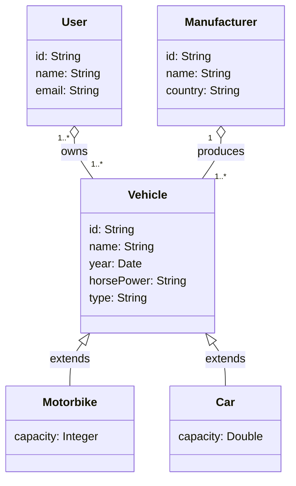

```mermaid
classDiagram
               
    class User {
        id: String
        name: String
        email: String
    }
    
    class Vehicle {
        id: String
        name: String
        year: Date
        horsePower: String
        type: String
    }
    
    class Manufacturer {
        id: String
        name: String
        country: String
    }
    
    class Motorbike {
        capacity: Integer
    }
            
    class Car {
        capacity: Double
    }
    
    Vehicle <|-- Motorbike: extends
    Vehicle <|-- Car: extends
    
    User "1..*" o-- "1..*" Vehicle : owns
    
    Manufacturer "1" o-- "1..*" Vehicle : produces
    
```